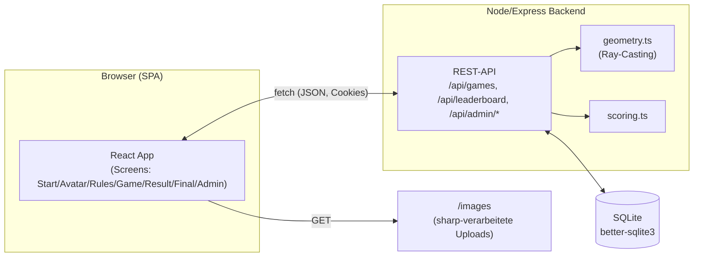

# Architektur

## 1. Systemarchitektur

npm-Workspaces-Monorepo mit drei Paketen: `shared` (Zod-Schemas, von Frontend
und Backend importiert), `frontend` (SPA) und `backend` (Express-API +
SQLite). Der Node-Prozess des Backends liefert im Produktivbetrieb zugleich
den gebauten Frontend-Build aus (`express.static` + Catch-all auf
`index.html`), sodass nur ein Container/Prozess läuft.

**Anti-Cheat-Kernprinzip:** Anomalie-Polygone und Erklärungen verlassen den
Server nie vor Rundenende. `GET /api/games/:gameId/tasks/:taskIndex` liefert
nur Bild-URL, Zeitlimit und Anzahl Bereiche. Jede vom Nutzer gesetzte
Markierung wird serverseitig per Ray-Casting (`services/geometry.ts`) gegen
die in SQLite gespeicherten Polygone geprüft; erst `POST .../finish` liefert
die volle Auflösung inkl. Score, der ausschließlich aus serverseitig
erfassten Werten berechnet wird (`services/scoring.ts`). Die Admin-Oberfläche
(Bildkatalog, Polygon-Pflege) ist per Cookie-Session (`cookie-session`)
geschützt.

## 2. Technologie-Stack

- **Frontend:** React 18 + TypeScript, Vite 6, Tailwind CSS 4 (+ Radix-UI-
  basierte Komponentenbibliothek im shadcn-Stil unter `app/components/ui`),
  Framer Motion (`motion`) für Übergänge, `react-router` als Dependency.
  Der Screen-Wechsel selbst läuft aktuell über einfachen `useState` in
  `App.tsx` (kein XState mehr im Einsatz). Die Bildinteraktion (Marker setzen
  und verschieben) nutzt native Pointer Events auf einem `
`-Overlay statt
  react-konva/Canvas.
- **Backend:** Node.js + Express 4, SQLite über `better-sqlite3`,
  Bildverarbeitung mit `sharp`, Validierung mit Zod (`shared`-Package),
  Datei-Uploads via `multer`, Sessions via `cookie-session`.
- **Tooling:** npm Workspaces, ESLint (Flat Config), Vitest (Unit-Tests
  Frontend + Backend), Playwright (E2E, `test:e2e`), TypeScript durchgehend.

> Hinweis: `CLAUDE.md` beschreibt für das Frontend noch react-konva/XState/CSS
> Modules — der aktuelle Code hat sich davon gelöst (Tailwind + Pointer
> Events + lokaler Component-State). Bei größeren Frontend-Änderungen bitte
> den tatsächlichen Stand in `packages/frontend/src` prüfen.

## 3. Deployment

Zweistufiger Docker-Build (`Dockerfile`): Stage 1 baut `shared`, `frontend`
und `backend` (inkl. nativer Module für `better-sqlite3`/`sharp`), Stage 2
enthält nur das produktionsreife `node_modules` plus die Build-Artefakte und
startet `node packages/backend/dist/index.js` auf Port 3001. SQLite-Datenbank
und Bild-Uploads liegen in einem gemounteten Volume (`/app/packages/backend/data`).

**CI/CD** (`.github/workflows/ci.yml`): Bei jedem Push/PR laufen Lint, Build
aller Workspaces, Unit- und Playwright-E2E-Tests. Bei Push auf `main` wird
nach erfolgreicher CI zusätzlich das Docker-Image gebaut und nach
`ghcr.io/<repo>:latest` gepusht; ein anschließender `deploy`-Job verbindet
sich per SSH mit dem VPS, zieht das neue Image (`docker compose pull && up -d`)
und wartet auf einen erfolgreichen Healthcheck (`/api/health`).

**Infrastruktur:** Ein DigitalOcean-VPS (Ubuntu) betreibt den App-Container
über `docker-compose.yml`, nur auf `127.0.0.1:3001` gebunden. **Caddy** läuft
davor als Reverse Proxy, terminiert TLS automatisch über Let's Encrypt und
bindet optional eine Basic-Auth-Sperre per `import basicauth_block` aus
`/etc/caddy/basicauth_block` ein (vom Setup-Skript `deploy/setup.sh`
generiert). Details zu Ersteinrichtung, Secrets und Rollback stehen in
`DEPLOYMENT.md`.
