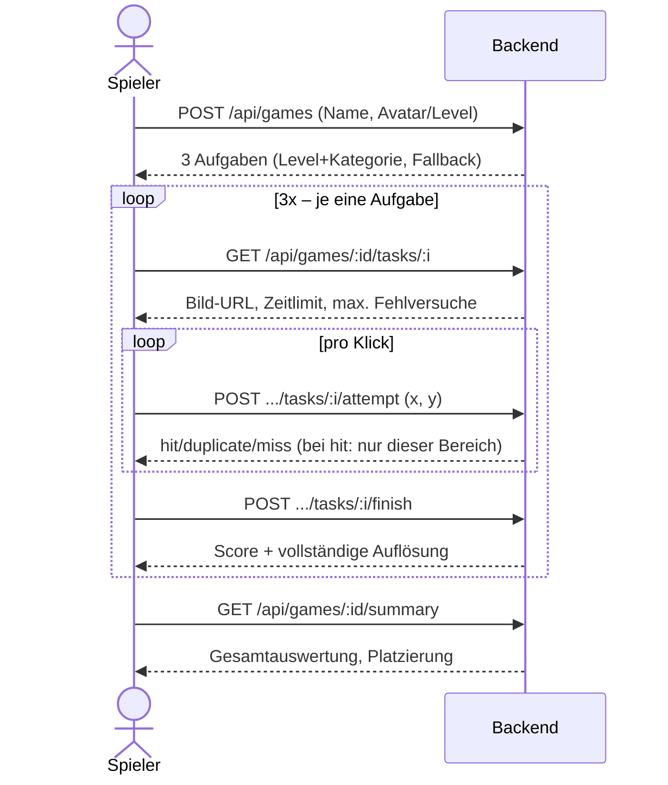
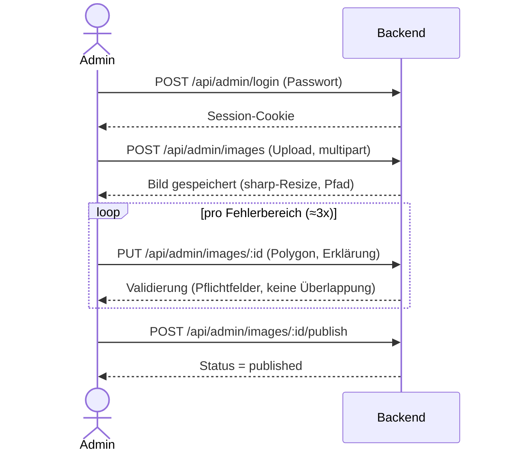

# Anforderungsdokument: KI-Bild-Anomalien-Spiel

Stand: 26.06.2026
Quelle: Mitschriften Team-Termine + PDF-Export (Anforderungen-Spiel-KI-Festival-2026)

---

## 1. Ziel der Anwendung

Webanwendung, in der Spieler KI-generierte oder KI-bearbeitete Bilder betrachten und innerhalb einer begrenzten Zeit kritische Anomalien erkennen. Ziel ist die Sensibilisierung für KI, Deepfakes und deren Risiken (Festival-Kontext).

Der Spieler tippt/klickt auf vermutete Fehlerbereiche. Korrekte Treffer, Fehlversuche, verbleibende Zeit und freiwilliges Überspringen beeinflussen den Score. Nach jeder Aufgabe wird erklärt, welche Anomalien vorhanden waren und warum.

Die Anwendung besteht aus einem **Spielerbereich** und einer **Admin-Oberfläche** zur Pflege der Bilder, Fehlerbereiche und Erklärtexte.

---

## 2. Rollen

### Spieler
Startet ein Spiel, gibt einen Namen ein, wählt einen Avatar, spielt drei Aufgaben. Erhält am Ende eine Gesamtpunktzahl und sieht seinen Score im Vergleich zu anderen Teilnehmenden.

### Admin
Pflegt den Bildkatalog: Bilder hochladen, kritische Bereiche einzeichnen, Erklärungen hinterlegen, Schwierigkeitsgrad und Parameter festlegen, Inhalte veröffentlichen.

---

## 3. Grundlegender Spielablauf

1. Startseite mit Buttons `Spiel starten` und `Leaderboard`
2. Namenseingabe
3. Avatar-Auswahl (Fuchs-Variationen); jede Variante ist humorig mit einem Level verknüpft (z. B. „Jungfuchs" bis „Erzfuchs") und steuert damit indirekt die Bildauswahl/Inhaltstiefe (siehe Abschnitt 4)
4. Spiel besteht aus genau 3 Aufgaben, pro Aufgabe genau ein Bild
5. Spieler muss innerhalb definierter Zeit kritische Bereiche finden (Klick/Tap)
6. Nach jeder Aufgabe: Ergebnisansicht
7. Nach drei Aufgaben: Gesamtauswertung
8. Rückkehr zur Startseite möglich

---

## 4. Bildauswahl und Schwierigkeitsgrade

Jedes Bild hat genau eine Kategorie: `leicht`, `mittel`, `schwer`.

Ein Spiel verwendet grundsätzlich je ein Bild aus jeder Kategorie, zufällig ausgewählt.

**Fallback-Regel:**
- Fehlt `schwer` → Bild aus `mittel`
- Fehlt `mittel` → Bild aus `leicht`
- Fehlt `leicht` → kein vollständiges Spiel startbar (Ersatzverhalten muss noch definiert werden)

Keine doppelten Bilder innerhalb eines Spiels, außer der Katalog reicht nicht aus (dann Mehrfachnutzung erlaubt).

---

## 4a. Avatar-/Level-Mechanik (Zielgruppe Kinder & Erwachsene)

**Hintergrund:** Am Festival-Stand können auch Kinder spielen. Die Avatar-Auswahl wird daher genutzt, um auf spielerische, humorige Art ein Schwierigkeits-/Inhalts-Level festzulegen, ohne dass explizit nach Alter gefragt wird.

- Jede Fuchs-Avatar-Variante repräsentiert ein Level: **Jungfuchs … Erzfuchs** (genaue Anzahl/Zwischenstufen final festzulegen)
- Das gewählte Level beeinflusst die Bildauswahl:
  - niedrigeres Level → einfachere/kindgerechte Bildmotive, ggf. weniger subtile Anomalien
  - höheres Level → anspruchsvollere Motive, ggf. auch ernstere/komplexere Themen
- Damit braucht jedes Bild zusätzlich zur Kategorie (`leicht`/`mittel`/`schwer`) ein **Eignungs-Tag** (z. B. `kinderfreundlich` / `allgemein`), das unabhängig vom Schwierigkeitsgrad ist
- Level beeinflusst die Filterung des Bildkatalogs, **nicht** die Scoring-Formel
- Die Auswahl „leicht/mittel/schwer" (Abschnitt 4) erfolgt weiterhin innerhalb des durch das Level gefilterten Teilkatalogs
- **Fallback:** Reichen die level-/eignungs-gefilterten Bilder nicht aus, werden Bilder der Kategorie `leicht` verwendet (unabhängig vom Eignungs-Tag)
- Bestehende Bilder müssen nicht rückwirkend mit dem Eignungs-Tag versehen werden (kein Migrationsaufwand)
- **Offen:** Wie wird das Level für Eltern/Kinder transparent vermittelt, ohne explizit nach Alter zu fragen? (siehe Abschnitt 18)


## 5. Admin-Oberfläche

- Bild einfügen/hochladen
- Kritische Bereiche als freie Formen einzeichnen
- Pro Bereich: Pflicht-Erklärtext
- Speichern/Veröffentlichen nur wenn vollständig:
  - Bild vorhanden
  - Kategorie gewählt
  - Eignungs-Tag gewählt (`kinderfreundlich` / `allgemein`)
  - mind. 1 kritischer Bereich
  - Erklärung je Bereich
  - max. Fehlversuche festgelegt
  - Zeitlimit festgelegt
  - keine überlappenden Fehlerbereiche
- `Fertig`-Button speichert Bild + Bereiche + Erklärungen + Einstellungen
- Pro Bild ca. 3 Fehlerbereiche; Anzahl Bereiche = Anzahl zu findender Fehler
- Überlappungsprüfung beim Zeichnen oder spätestens beim Speichern
- Bearbeitung veröffentlichter Bilder möglich (Recheck Editor + Schwierigkeit, Löschen/Hinzufügen)
- Alte Scores bleiben unverändert, wenn ein Bild nachträglich geändert wird
- Status: `draft` / `published` / `archived`

---

## 6. Datenmodell pro Bild

```ts
{
  id: string,
  title: string,
  imageUrl: string,
  category: "leicht" | "mittel" | "schwer",
  suitability: "kinderfreundlich" | "allgemein",
  timeLimitSeconds: number,
  maxWrongAttempts: number,
  anomalyAreas: [
    {
      id: string,
      shape: FreeformShape,
      explanation: string
    }
  ],
  status: "draft" | "published" | "archived"
}
```

`FreeformShape`: technisch als Polygon umgesetzt (Entscheidung: **Polygon – Rechteck**). Muss prüfbar sein, ob ein Spieler-Klick innerhalb der Form liegt.

---

## 7. Spielansicht

Obere Leiste zeigt:
- Treffer, z. B. `Treffer: 1/3` (gefunden / max. Fehler im Bild)
- Countdown-Timer
- Fehlversuche, z. B. `Fehlversuche: 2/6` (falsche Klicks / max. erlaubt)

Klick/Tap wird gegen offene Fehlerbereiche geprüft.

---

## 8. Feedback während der Aufgabe

**Korrekter Treffer:**
- Popup mit Haken-Symbol (~1 Sek.)
- Bereich wird mit Pinnadel markiert, gilt als gefunden, nicht mehr klickbar
- Trefferanzeige + interner Score-Zustand aktualisiert
- Erneuter Klick auf einen bereits gefundenen Bereich wird ignoriert (kein Fehlversuch, keine Wertung)

**Fehlversuch:**
- Popup mit rotem Kreuz (~1 Sek.)
- Fehlversuchsanzeige + interner Score-Zustand aktualisiert
- Keine vollständige Auflösung an dieser Stelle

---

## 9. Beendigung einer Runde

Rundenende bei einem der vier Zustände:
1. Alle Fehler gefunden
2. Max. Fehlversuche erreicht
3. Zeit abgelaufen
4. Spieler überspringt freiwillig (`Weiter`, keine Bestätigungsabfrage, wirkt sich negativ auf Score aus)

Danach: Ergebnisansicht (nicht direkt nächste Aufgabe).

---

## 10. Ergebnisansicht nach einer Runde

Enthält: Bild, alle Fehlerbereiche, Fehlerbeschreibungen, Score der Aufgabe, optional Score-Erklärung.

- Gefundene Bereiche: grün hinterlegt
- Nicht gefundene Bereiche: rot hinterlegt
- Sichtbar bis Klick auf `Weiter` → nächste Aufgabe oder Endauswertung

---

## 11. Endauswertung

Enthält: Spielername, Avatar, Score pro Aufgabe, Gesamtpunktzahl, Anzahl gefundener Fehler gesamt, Anzahl Fehlversuche gesamt, Vergleich mit anderen Teilnehmenden, Platzierung im Leaderboard.

Danach Rückkehr zur Startseite.

---

## 12. Leaderboard

Mindestens: Rang, Spielername, Avatar, Gesamtpunktzahl.

Optional: Datum, gespielte Kategorien, Gesamtzeit, Trefferquote, Anzahl Fehlversuche.

**Entscheidung:** Jeder Versuch wird gespeichert (nicht nur Bestwert), inkl. Zeitstempel zur Unterscheidung bei Namensdopplung.

---

## 13. Scoring

Pro Aufgabe: 0–1000 Punkte.

```ts
hitRatio = hits / totalAreas
timeRatio = remainingTime / timeLimit
wrongRatio = wrongAttempts / maxWrongAttempts

baseScore = 1000 * hitRatio
timeBonus = 250 * hitRatio * timeRatio
wrongPenalty = 300 * wrongRatio
skipPenalty = skipped ? 200 * (1 - hitRatio) : 0

rawScore = baseScore + timeBonus - wrongPenalty - skipPenalty
score = clamp(round(rawScore), 0, 1000)
```

**Beispiel:** 3 Fehlerbereiche, 2 gefunden, 1 Fehlversuch (max. 6), 20s übrig (von 60s), kein Skip → Score 674. Mit Skip zusätzlich: Score 608.

Grundprinzipien:
- Keine Treffer → 0 oder sehr wenige Punkte
- Zeitbonus nur bei vorhandenen Treffern
- Fehlversuche reduzieren Score
- Skip wird besonders negativ bewertet, wenn noch viele Fehler offen sind

---

## 14. State-Management

Benötigte Zustände (mindestens):
- aktueller Screen, Spielername, Avatar
- ausgewählte Aufgaben, aktuelle Aufgabe
- Timer, gefundene Fehlerbereiche, Fehlversuche
- Popups (Treffer/Fehler), Rundenergebnis, Gesamtscore
- Leaderboard-Daten
- Admin-Bilddaten, Admin-Zeichenzustand

Technologie-Optionen: Zustand, Redux, Pinia, React Context, XState. State-Machine-Ansatz empfohlen wegen klarer Zustandsübergänge.

---

## 15. Technische Kernanforderungen

- Webanwendung, Maus + Touch
- Canvas oder canvas-ähnliche Fläche für Bildinteraktion
- Treffererkennung: Klick innerhalb freier Form
- Zuverlässige Verwaltung von Timer, Treffern, Fehlversuchen, Rundenzuständen
- Backend/Datenbank für: Bildkatalog, Fehlerbereiche, Erklärungen, Leaderboard, Admin-Inhalte
- Frühphase: lokale Speicherung möglich; Mehrnutzer-Betrieb: serverseitige Speicherung nötig
- GUI und Backend sollen lose gekoppelt sein (robust gegenüber Verbindungsabbrüchen, kein hartes Pausieren/Fortsetzen einer Session)
- Deployment lokal via Docker am Festival-Stand; Zielbrowser Edge, App zusätzlich als PWA lauffähig
- Geringe erwartete Last (kein High-Concurrency-Design erforderlich)
- Basis-Logging für Fehler/Crashes im Live-Betrieb

---

## 16. Technologie-Entscheidungen

| Frage | Entscheidung |
|---|---|
| Frontend-Stack | React + TypeScript + Vite |
| Bildinteraktion | react-konva (Wrapper um Canvas/Konva.js) |
| Backend | Node/Express + SQLite |
| Speicherform freie Form | Polygon – Rechteck |
| Bearbeitung veröffentlichter Bilder | Ja – Recheck Editor & Schwierigkeit, Löschen/Hinzufügen |
| Alte Scores bei Bildänderung | Bleiben unverändert |
| Draft/Veröffentlichung | Im Admin-Bereich möglich |
| Leaderboard-Anzeige | Jeder Versuch (mit Zeitstempel) |
| Datenschutz/Moderation/Barrierefreiheit | MVP: Info-Button mit Hinweis zu Datenschutz & Namensmoderation |
| Score-Sichtbarkeit während Aufgabe | Nein, nur am Rundenende |
| Soundeffekte | Nein |
| Kopplung GUI/Backend | Lose gekoppelt (GUI muss bei Verbindungsabbruch robust bleiben) |
| Session-Pause/Fortsetzen | Nicht möglich – Spiel bricht bei Abbruch/Tab-Wechsel ab |
| Wiederholter Klick auf gefundenen Bereich | Wird ignoriert, zählt nicht als Fehlversuch |
| Admin-Zugriffsschutz | Einfaches, festgelegtes Passwort (kein vollwertiges Rollensystem) |
| Bild-Upload | Standard-Validierung für mittelgroße, bildschirmtaugliche Bilder (Formate/Limits im Detail bei Umsetzung festlegen) |
| Mehrsprachigkeit | Nein, nur Deutsch |
| Spielername | Keine Eindeutigkeitsprüfung; Mindestlänge + Prüfung auf anstößige Begriffe |
| Erwartete Last | Gering (kein High-Concurrency-Design nötig) |
| Deployment | Lokal via Docker am Festival-Stand |
| Barrierefreiheit | Übliche Mindeststandards, keine besonderen Anforderungen |
| DSGVO | Hinweistext + Namensprüfung als Mindeststandard |
| Geräte/Browser | Edge; App soll zusätzlich als PWA lauffähig sein |
| Logging | Basis-Logging für Fehler/Crashes |
| Content-Pipeline | Bild-Upload erfolgt, sobald Admin-Oberfläche + DB stehen |
| Testlauf vor Festival | Ja, mit echten Nutzern |
| Level-Bezeichnungen | Jungfuchs … Erzfuchs (Skala final definieren) |
| Fallback bei zu wenigen Level-Bildern | Bilder der Kategorie `leicht` verwenden |
| Migration bestehender Bilder mit Eignungs-Tag | Nicht erforderlich |

---

## 17. MVP-Umfang

- Startseite (`Spiel starten`, `Leaderboard`)
- Namenseingabe, Avatar-Auswahl (Fuchs)
- Spiel mit 3 Aufgaben (leicht/mittel/schwer, Fallback-Logik)
- Obere Spielleiste (Treffer, Timer, Fehlversuche)
- Klick-/touchfähiges Bild mit freien Fehlerbereichen
- Feedback: Haken-Popup, rotes Kreuz, Pinnadel
- Rundenende-Logik (4 Trigger)
- Ergebnisansicht (grün/rot, Erklärungen)
- Scoring 0–1000
- Gesamtauswertung
- Einfaches Leaderboard
- Admin-Oberfläche (Upload, Bereiche zeichnen, Erklärungen erfassen)

---

## 17a. Architektur

### Technologie-Entscheidungen (final)

| Bereich | Wahl | Begründung |
|---|---|---|
| Frontend | React + TypeScript + Vite | bestätigt |
| Bildinteraktion | react-konva | bestätigt |
| State-Management | XState | klare Zustandsübergänge (Screens, Rundenende, Admin-Zeichenzustand) |
| Backend | Node/Express | bestätigt |
| Datenbank | SQLite (Datei auf Docker-Volume) | passt zu geringer Last + lokalem Deployment |
| Bilddateien | Filesystem (Volume), Pfad in DB, Auslieferung direkt vom Backend (`/images/:id`) | einfach, kein separater Static-Server nötig |
| Bild-Resizing | `sharp` beim Upload auf Standardgröße | konsistente Darstellung, kleinere Dateien |
| Validierung | Zod (Frontend + Backend gemeinsam) | doppelte Validierungslogik vermeiden |
| Admin-Zugriff | Geteiltes Passwort, Session-Cookie | einfach, ausreichend fürs Szenario |
| Polygon-Koordinaten | Relativ gespeichert (0–1, normalisiert zur Bildgröße) | Responsive-Skalierung ohne Umrechnung von Admin-Pixelwerten |
| Admin-Oberfläche | Eigene Route (`/admin`) innerhalb derselben React-App | weniger Build-/Deployment-Overhead |
| Verbindungsfehler bei Score-Submit | Fehlermeldung anzeigen, kein Retry/Queue (MVP) | einfacher, ausreichend bei geringer Last |
| Deployment | Docker, ein Container liefert Frontend (Build-Output) + Backend aus einem Express-Prozess | ein `docker compose up`, kein nginx nötig |
| PWA | vite-plugin-pwa, Service Worker cached App-Shell | Lauffähig auch bei kurzen WLAN-Ausfällen (Score-Submit selbst nicht offline-fähig, siehe oben) |

### Komponentenstruktur (Frontend)

```
src/
  app/
    AppMachine.ts          // XState: Screen-Routing (Start, Game, Result, Final, Leaderboard, Admin)
  screens/
    StartScreen/
    NameAvatarScreen/       // Name + Avatar/Level-Auswahl
    GameScreen/
      GameCanvas.tsx        // react-konva: Bild + Polygone + Klick-Erkennung
      TopBar.tsx             // Treffer / Timer / Fehlversuche
      FeedbackPopup.tsx      // Haken / rotes Kreuz
    RoundResultScreen/
    FinalResultScreen/
    LeaderboardScreen/
    admin/
      AdminLoginScreen/
      AdminImageList/
      AdminImageEditor/      // Upload + Polygon-Zeichnen + Erklärungen
  machines/
    gameMachine.ts           // XState: Rundenlogik (Timer, Treffer, Fehlversuche, Rundenende)
    adminEditorMachine.ts     // XState: Zeichenzustand (Polygon zeichnen, Validierung)
  api/
    client.ts                // fetch-Wrapper
  schemas/
    *.ts                      // Zod-Schemas (geteilt mit Backend, z. B. via shared-Package oder Copy)
```

### Komponentenstruktur (Backend)

```
src/
  index.ts
  db/
    schema.sql / migrations
    client.ts                 // SQLite-Verbindung (z. B. better-sqlite3)
  routes/
    game.ts                   // Spielstart, Rundenende, Score-Submit
    leaderboard.ts
    images.ts                 // Bildauslieferung /images/:id
    admin/
      auth.ts                 // Login mit geteiltem Passwort
      catalog.ts               // CRUD Bildkatalog
  middleware/
    adminAuth.ts               // Session-Check
  services/
    imageProcessing.ts          // sharp-Resizing
    scoring.ts                  // Score-Formel
    gameSelection.ts             // Level/Kategorie-Filter + Fallback-Logik
  schemas/
    *.ts                        // Zod-Schemas
```

### API-Endpunkte (Vorschlag)

**Spieler-Bereich (öffentlich)**
| Methode | Pfad | Zweck |
|---|---|---|
| POST | `/api/games` | Neues Spiel starten (Name, Avatar/Level) → liefert 3 Aufgaben (gefiltert nach Level+Kategorie inkl. Fallback) |
| GET | `/api/games/:gameId/tasks/:taskIndex` | Details einer Aufgabe (Bild-URL, Zeitlimit, max. Fehlversuche; **keine** Anomalie-Koordinaten/Erklärungen) |
| POST | `/api/games/:gameId/tasks/:taskIndex/attempt` | Einzelner Klick (normalisierte x/y) wird serverseitig gegen die Polygone geprüft → `hit` / `duplicate` / `miss`; bei Treffer wird nur der getroffene Bereich (Polygon + Erklärung) zurückgegeben |
| POST | `/api/games/:gameId/tasks/:taskIndex/finish` | Runde beenden (verbleibende Zeit, skipped) → Score wird aus den serverseitig erfassten Treffern/Fehlversuchen berechnet, liefert vollständige Auflösung (alle Bereiche) |
| GET | `/api/games/:gameId/summary` | Gesamtauswertung (nach 3 Aufgaben) |
| GET | `/api/leaderboard` | Leaderboard-Daten |
| GET | `/images/:id` | Bildauslieferung |

**Admin-Bereich** (geschützt durch Session-Cookie nach Passwort-Login)
| Methode | Pfad | Zweck |
|---|---|---|
| POST | `/api/admin/login` | Passwort prüfen, Session setzen |
| POST | `/api/admin/logout` | Session beenden |
| GET | `/api/admin/images` | Bildkatalog (alle Status) |
| POST | `/api/admin/images` | Neues Bild anlegen (Upload, multipart) |
| PUT | `/api/admin/images/:id` | Bild/Bereiche/Erklärungen aktualisieren |
| POST | `/api/admin/images/:id/publish` | Status auf `published` setzen (inkl. Vollständigkeitsprüfung) |
| DELETE | `/api/admin/images/:id` | Bild löschen/archivieren |

**Wichtig:** Da die Anomalie-Koordinaten dem Client nie vor Rundenende bekannt sind, kann der Client Treffer nicht selbst berechnen. Jeder Klick wird daher einzeln per `attempt`-Request serverseitig per Ray-Casting gegen die Polygone geprüft und in der DB mitgeführt. `finish` berechnet den Score aus diesen serverseitig erfassten Werten – nicht aus Client-Angaben. Wiederholte Klicks auf bereits gefundene Bereiche liefern `duplicate` und zählen nicht als Fehlversuch.
**Referenz auf die aktuelle [[API-Dokumentation]]**


### Datenbank-Schema (SQLite, Vorschlag)

```sql
CREATE TABLE images (
  id TEXT PRIMARY KEY,
  title TEXT NOT NULL,
  image_path TEXT NOT NULL,
  category TEXT NOT NULL CHECK (category IN ('leicht','mittel','schwer')),
  suitability TEXT NOT NULL CHECK (suitability IN ('kinderfreundlich','allgemein')),
  time_limit_seconds INTEGER NOT NULL,
  max_wrong_attempts INTEGER NOT NULL,
  status TEXT NOT NULL CHECK (status IN ('draft','published','archived')) DEFAULT 'draft',
  created_at TEXT NOT NULL DEFAULT (datetime('now')),
  updated_at TEXT NOT NULL DEFAULT (datetime('now'))
);

CREATE TABLE anomaly_areas (
  id TEXT PRIMARY KEY,
  image_id TEXT NOT NULL REFERENCES images(id) ON DELETE CASCADE,
  polygon_json TEXT NOT NULL,        -- normalisierte Koordinaten [{x,y}, ...], 0–1
  explanation TEXT NOT NULL
);

CREATE TABLE games (
  id TEXT PRIMARY KEY,
  player_name TEXT NOT NULL,
  avatar_level TEXT NOT NULL,         -- z.B. 'jungfuchs' .. 'erzfuchs'
  created_at TEXT NOT NULL DEFAULT (datetime('now')),
  total_score INTEGER,
  finished_at TEXT
);

CREATE TABLE game_tasks (
  id TEXT PRIMARY KEY,
  game_id TEXT NOT NULL REFERENCES games(id) ON DELETE CASCADE,
  task_index INTEGER NOT NULL,        -- 0,1,2
  image_id TEXT NOT NULL REFERENCES images(id),
  wrong_attempts INTEGER NOT NULL DEFAULT 0,
  remaining_time_seconds INTEGER,
  skipped INTEGER,                    -- boolean 0/1
  score INTEGER,
  completed_at TEXT
);

CREATE TABLE game_task_hits (
  game_task_id TEXT NOT NULL REFERENCES game_tasks(id) ON DELETE CASCADE,
  area_id TEXT NOT NULL REFERENCES anomaly_areas(id),
  PRIMARY KEY (game_task_id, area_id)
);

CREATE TABLE leaderboard_entries (
  id TEXT PRIMARY KEY,
  game_id TEXT NOT NULL REFERENCES games(id),
  player_name TEXT NOT NULL,
  avatar_level TEXT NOT NULL,
  total_score INTEGER NOT NULL,
  created_at TEXT NOT NULL DEFAULT (datetime('now'))
);
```

*Anmerkung:* `leaderboard_entries` ist hier bewusst redundant zu `games` gehalten (denormalisiert), damit Leaderboard-Abfragen einfach und schnell bleiben, auch wenn sich das `games`-Schema später ändert.

### Docker-Setup (Skizze)

```
docker-compose.yml
  app:
    build: .                # Multi-Stage: Frontend-Build → in Express-Static-Ordner kopieren
    ports: ["80:3000"]
    volumes:
      - ./data:/app/data     # SQLite-Datei + Bild-Uploads
    environment:
      - ADMIN_PASSWORD=...
```

Ein Service reicht: Express liefert sowohl die API als auch die gebauten React-Assets sowie die Bilder aus.

### Sequenzdiagramme

**Spielablauf (Spieler ↔ Backend)**



**Admin – Bild-Erstellung**



---

## 17b. Developer-Setup & Versionsverwaltung

### Repo-Struktur

Ein Repo (Monorepo) statt getrennter Frontend-/Backend-Repos – Begründung: gemeinsames Deployment in einem Container, geteilte Zod-Schemas, kleines Team, ein Release-Ziel (Festival).

```
ki-bild-anomalien-spiel/
├── package.json              # Root, definiert npm Workspaces
├── packages/
│   ├── frontend/
│   │   ├── package.json
│   │   ├── src/
│   │   └── vite.config.ts
│   ├── backend/
│   │   ├── package.json
│   │   ├── src/
│   │   └── data/               # SQLite-Datei, Bild-Uploads (gitignored)
│   └── shared/
│       ├── package.json
│       └── src/
│           └── schemas/         # Zod-Schemas, gemeinsam genutzt
├── Dockerfile
├── docker-compose.yml
├── .gitignore
├── .github/
│   └── workflows/
│       └── ci.yml
└── README.md
```

`shared` wird per `workspace:*` (bzw. `file:../shared`) lokal referenziert – kein npm-Publishing nötig.

### Lokale Entwicklung

```bash
npm install                        # installiert alle Workspaces
npm run dev --workspace=backend     # Express via tsx, z. B. Port 3001
npm run dev --workspace=frontend    # Vite Dev-Server, Port 5173 (proxyt /api an Backend)
```

Root-Skript für Komfort (`concurrently`):
```json
"scripts": { "dev": "concurrently \"npm:dev --workspace=backend\" \"npm:dev --workspace=frontend\"" }
```

### Versionsverwaltung

- **Ein GitHub-Repo**, einfaches Branching (`main` + Feature-Branches, kein Gitflow nötig)
- `.gitignore`: `node_modules/`, `packages/backend/data/`, `dist/`, `.env`
- Secrets (Admin-Passwort etc.) über `.env`, nicht eingecheckt; im Docker-Compose via `environment` injiziert
- Optional: separater eingecheckter `seed-images/`-Ordner für Entwicklungs-/Testbilder, getrennt vom Daten-Volume

### CI (GitHub Actions, Vorschlag)

```yaml
name: CI
on:
  pull_request:
  push:
    branches: [main]

jobs:
  build-and-check:
    runs-on: ubuntu-latest
    steps:
      - uses: actions/checkout@v4
      - uses: actions/setup-node@v4
        with:
          node-version: 20
          cache: npm
      - run: npm install
      - run: npm run lint --workspaces --if-present
      - run: npm run build --workspaces --if-present
```

Damit gibt es bei jedem Pull Request einen automatischen Lint- und Build-Check. Ein Test-Job (`npm test`) kann ergänzt werden, sobald es Tests gibt.

### Branch-Schutz (empfohlen)

- `main` geschützt: PR erforderlich, CI muss grün sein
- Direkte Pushes auf `main` deaktivieren

---

Die meisten ursprünglich offenen Fragen sind mittlerweile geklärt und in die jeweiligen Abschnitte (4a, 8, 16) eingearbeitet. Es verbleiben:

1. **Skalierung der Polygon-Koordinaten** bei unterschiedlichen Bildschirmgrößen/Responsive Design – wie werden die Admin-seitig erfassten Koordinaten auf unterschiedliche Client-Auflösungen übertragen?
2. **Transparente Level-Vermittlung:** Wie wird Eltern/Kindern das Level (Jungfuchs … Erzfuchs) verständlich gemacht, ohne explizit nach Alter zu fragen?
3. **Bild-Upload-Details:** konkrete erlaubte Formate, Größen- und Auflösungsgrenzen technisch festlegen (Grundprinzip „mittlere Größe, bildschirmtauglich" steht bereits)
4. **Liste anstößiger Begriffe** für die Namensprüfung: eigene Wortliste, externe Bibliothek, oder einfacher Blocklist-Ansatz?

> Alle übrigen Punkte (1–17, 19, 20 der ursprünglichen Liste) sind entschieden – siehe Entscheidungstabelle in Abschnitt 16 sowie die jeweiligen Fachabschnitte.

---

## 19. Zusätzliche Referenz

YouTube-Video als inhaltlicher Bezugspunkt: „Wie können wir dem Internet wieder vertrauen – The Morpheus"
